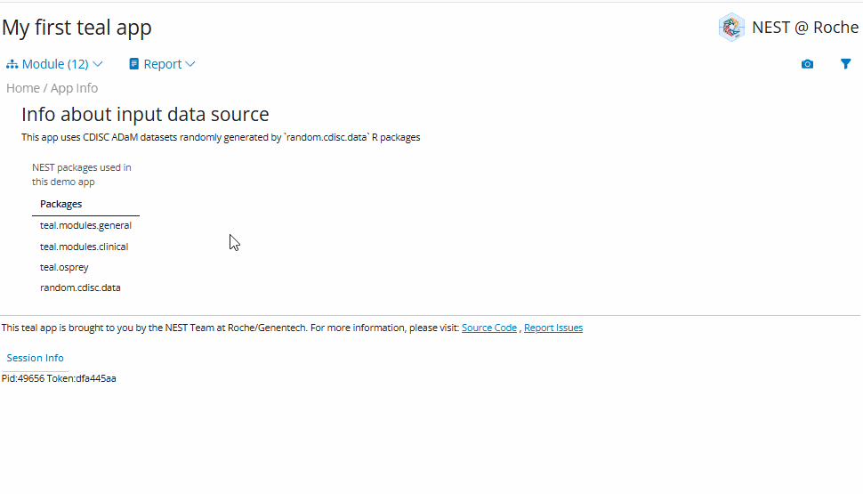

<!-- Generated by app_readme_template.Rmd and generate_app_readme.R: do not edit by hand-->

# early-dev app

### Run the app yourself

    source("https://raw.github.com/insightsengineering/teal.gallery/main/_internal/utils/sourceme.R")

    # Run the app after installing all the stable versions of teal dependencies
    restore_and_run("early-dev", package_repo = "https://insightsengineering.r-universe.dev")

    # Run the app after installing all the beta versions of teal dependencies
    restore_and_run("early-dev", package_repo = "https://pharmaverse.r-universe.dev")

### View the deployed app

Deployed app: <https://genentech.shinyapps.io/NEST_early-dev_stable>

### Preview the app

<!-- -->
