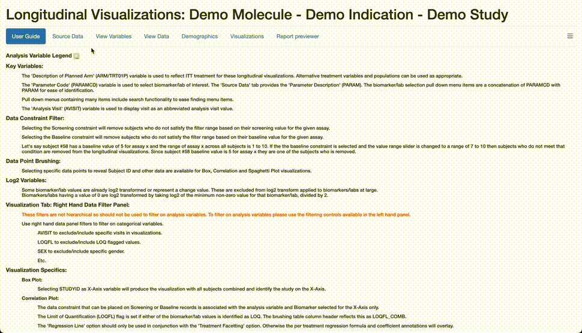

<!-- Generated by app_readme_template.Rmd and generate_app_readme.R: do not edit by hand-->

# longitudinal app

### Run the app yourself

    source("https://raw.github.com/insightsengineering/teal.gallery/main/_utils.R")
    run_teal_gallery("longitudinal")

### View the deployed app

Deployed app: <https://genentech.shinyapps.io/NEST_longitudinal_main>

### Preview the app

<!-- -->
